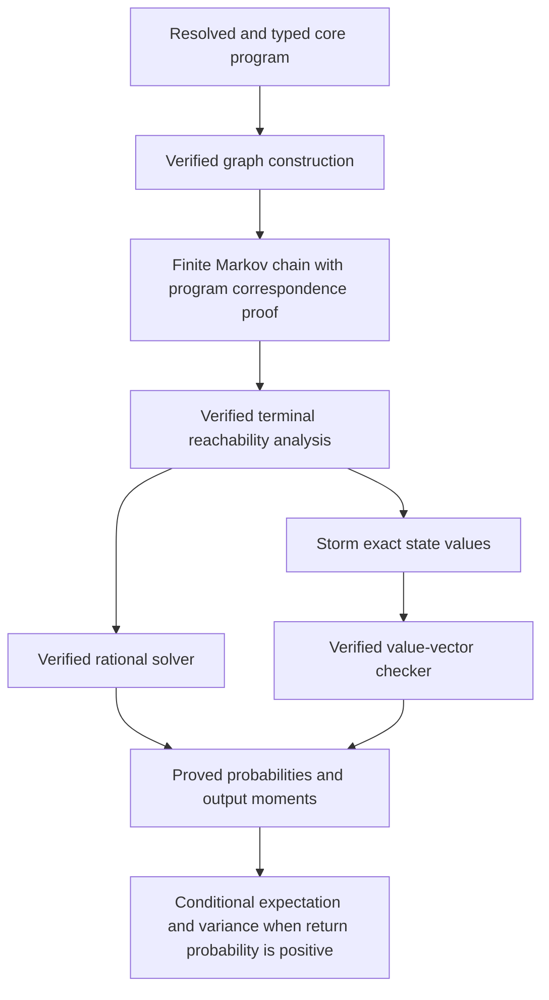

# Verified exact computation

Build one verified path from a resolved core program to a finite Markov chain,
then support two ways to obtain a proved answer: our verified rational solver,
or a checked vector of exact values from Storm. Both routes should use the same
model, boundary conditions, and semantic correctness theorem.

The target is exact computation of returned outputs for finite DTMCs, including
rejection and divergence. This is not a plan to formalize all of Storm or PCTL.

## Current position

- [x] Exact machine steps are connected to the paper semantics.
- [x] Graph replay proves domain safety and equality of complete output laws.
- [x] Gaussian elimination returns a proof of the original equations.
- [x] The expected-reward solver proves equation validity and absorption without
  calling the result checker. Successful results equal the model expectation.
- [x] Saved graph and result certificates can be independently kernel-checked.
- [x] Prove correctness of the graph-building algorithm itself.
- [ ] Support result computation for finite chains with nontermination.
- [ ] Certify return probability, conditional expectation, and conditional variance.
- [ ] Check Storm-produced values rather than merely compare initial-state answers.

The graph builder now returns a correctness proof directly; portable exports retain independent replay.
The result solver is now verified, although portable exports still use a result
checker. Storm currently receives an exported model and compares its initial-state
answer with an answer already computed and certified by Lean.

## Intended architecture

Graph replay leaves the normal execution path after graph construction is proved.
Keep it for externally supplied graphs and optional portable exports. Similarly,
our verified solver needs no result checker, but externally supplied Storm values
do. Removing a checker at an external boundary would remove the guarantee unless
we verified that external implementation instead.

## 1. Verify graph construction

Reuse `Candidate.ReplayValid` and `replay_matches`; do not rebuild the connection
to the paper semantics. Separate graph data from the exploration algorithm first,
so the explorer can use the invariants without introducing an import cycle.

- [x] Factor graph data/invariants into modules independent of the BFS algorithm.
- [x] Construct each row by summing all outcomes for each destination and retaining
  positive weights; prove normalization, uniqueness, and zero-weight omission.
- [x] Define a builder state with proofs that the state array and lookup map agree,
  stored states are distinct, and the completed rows separate processed and pending states.
- [x] Prove that inserting a successor preserves those invariants, including when
  it was previously discovered or its hash collides with another state.
- [x] Prove each completed row has correct weights, complete successor coverage,
  valid destinations, and the right return/rejection classification.
- [x] Prove the initial builder state is valid and every expansion preserves validity.
- [x] Given a scoped source, derive `ReplayValid` when the queue is exhausted.
  Keep the source-scoping premise explicit or check it at entry.
- [x] Return the existing `CheckedModel` directly and remove runtime replay from
  the internal export path. Retain replay for imported graph data.
- [x] Preserve limits and errors: an incomplete exploration never returns a model.

Acceptance: the new builder handles the existing corpus and cyclic graphs;
its result carries `Model.Matches` without calling `checkModelReplay`. Test duplicate
successors, zero weights, hash collisions, every resource limit, rejection, and
invalid operations. Compare outputs and runtime with the old builder plus replay.
Prove successful-output correctness first; do not also promise an unbounded
exploration procedure terminates whenever the semantic state space is finite.

Implemented in `Build.lean`, `SparseRow.lean`, and `BuildModel.lean`. The old
explorer lives only in `Tests/ReferenceExplorer.lean`. All exploration unit tests
and four export integration tests pass, including independent kernel replay.
A local comparison on 107/287/557-state countdown programs measured 35/145/449 ms
for construction, versus 70/359/1261 ms for the old explorer plus replay. These
are indicative development measurements, not paper evaluation results.

## 2. Share verified analysis of termination and divergence

A finite graph need not terminate. The current absorption requirement rejects
such graphs even though finitely many terminal rewards imply finite output
moments. Simply accepting arbitrary solutions of their singular equations is
unsound: a nonterminating self-loop admits every constant as a solution.

Let T be the returned and rejected states. Compute the states C that can reach T
along positive-probability edges. Let D be the complement of C.

- [ ] Verify reverse reachability from T, including a path/rank witness for C.
- [ ] Prove D is closed under positive-probability transitions and produces no output.
- [ ] Prove every state outside T and D has a positive-probability path to T.
  Ranks need decrease along a chosen edge, not along every edge; loops remain allowed.
- [ ] Derive almost-sure absorption into T or D. Finiteness supplies a uniform
  positive escape probability within a finite number of steps.
- [ ] Generalize the existing uniqueness proof to equations with boundary values
  on T and D. Keep the current horizon certificate as a working baseline until
  the replacement is proved and measured.
- [ ] Solve only the remaining states, using zero output moments on D. Preserve
  D's meaning as divergence; do not report it as rejection.

Reverse reachability suffices here; a verified SCC implementation is not required.
There may still be unbounded execution time. Absorption into the analysis boundary
T or D does not assert that the original program terminates almost surely.

Acceptance: pure divergence, mixed return/divergence, mixed rejection/divergence,
and probabilistic retry cycles all produce the correct answers. Spurious values
on nonterminating classes must be rejected. The initial state may itself be terminal
or in D, and T may be empty.

## 3. Certify the quantities used in the paper

Use one boundary-value theorem with several right-hand sides, rather than a
separate model checker for each observable. Terminal relabelling is an internal
query operation; prove its connection to the original program's output law.

| Quantity | Returned state with value r | Rejected state | State in D |
| --- | --- | --- | --- |
| Return probability p | 1 | 0 | 0 |
| Rejection probability | 0 | 1 | 0 |
| Divergence probability | 0 | 0 | 1 |
| First output moment m1 | r | 0 | 0 |
| Second output moment m2 | r² | 0 | 0 |

- [ ] Prove the query equations represent these probabilities and moments.
- [ ] Prove return + rejection + divergence = 1 for the certified finite model.
- [ ] Obtain E_ret = m1/p and Var_ret = m2/p - (m1/p)² when p > 0.
- [ ] Report no conditional distribution when p = 0, rather than divide by zero.
- [ ] Compose these results with `Model.Matches` to export theorems about the
  selected paper program, not only its matrix.
- [ ] Share elimination across multiple right-hand sides if profiling justifies it;
  keep a proof for every returned vector.

A model of the transformed program certifies that program's moments. Transferring
an answer back to the source still requires the determinization theorem's source
premises. In particular, target finiteness does not prove source domain safety or
source integrability. Preserve those premises explicitly in any transfer theorem.

Acceptance: exact ground truths with rejection, signed outputs, zero return
probability, divergence, and nonzero conditional variance. Both backend routes
must yield the same theorem statements and normalization conventions.

## 4. Make Storm a source of checked certificates

The pinned `stormpy` 1.14.0 API exposes exact quantitative result vectors through
`get_values()`. Request `only_initial_states=False` and check that a full vector
was returned. Our adapter can package those values as a certificate; Storm need
not emit a Lean proof or a bespoke certificate format.

This API capability was confirmed in the upstream bindings and tests; the new
adapter and property encodings still need to be tested with the pinned binary.

- [ ] First prove the route works on absorbing examples using the existing result
  checker: export a model without calling our rational solver, query Storm for
  every state's exact value, and check that vector in Lean.
- [ ] Decode exact rational numerators/denominators without a floating-point conversion.
- [ ] Check vector dimensions and state mapping, including the exporter's synthetic
  `done` sink and terminal reward convention. Reject missing or nonfinite values.
- [ ] Validate equations against the original certified Lean model, not only the
  matrix loaded by Storm. This keeps serialization and Storm outside the proof.
- [ ] Use the shared boundary analysis from step 2 for divergence. Do not assume
  Storm's reward-until-target convention matches finite returned-output moments
  when the target may never be reached. Prepare the appropriate boundary query
  and validate the resulting values against the original model's equations.
- [ ] Support return mass, first moment, and second moment. Retain positive/negative
  reward splitting where Storm requires nonnegative rewards.
- [ ] Produce a standalone Lean theorem whose numeric values actually came from
  Storm. It must succeed with our equation solver disabled.
- [ ] Retain optional differential comparisons against our solver as tests.

Lean supplies or verifies absorption/reachability evidence; it never trusts a
Storm termination claim. Exact rational arithmetic alone is not a proof.

Acceptance: real Storm integration tests with rational weights, negative rewards,
rejection, and divergence. Tamper with values, state ordering, reward signs, the
sink mapping, and the selected subject; wrong claims must not be accepted. Test
large models without inheriting the internal dense solver's 256-state limit.

## 5. Keep the executable path and portable proofs distinct

- [ ] Internal path: use the verified explorer and solver's proofs directly,
  without recomputing graph or equation checks.
- [ ] External path: retain small total checkers for supplied graph data and Storm
  values, with the same semantic contracts as the internal path.
- [ ] Benchmark kernel reconstruction by rerunning verified algorithms versus
  checking saved certificates. Choose the default export on measured time and
  file size; keep this choice out of public theorem statements.
- [ ] Avoid dense all-pairs scans in external graph checking if they dominate.
  Prove any sparse checker equivalent to the existing graph contract.
- [ ] Keep imported results bound to the caller-selected source, subject, model,
  and observable. A digest may help identify files but is not a semantic proof.

## 6. Consolidate the paper and artifact

- [ ] Update the architecture figure to show verified graph construction followed
  by the verified solver or Storm plus a verified result checker.
- [ ] Add the exact-computation subsection to Implementation with the two routes,
  their finite-state restriction, and the probabilities/moments they certify.
- [ ] Keep mathematical claims in `Spec/`; keep builder invariants, graph analysis,
  linear algebra, certificate representations, and helper lemmas behind the
  existing review boundary where they do not change those claims.
- [ ] Update the finite-model contract and CLI documentation as each milestone lands.
- [ ] Run Lean axiom checks, corpus tests, independent kernel replay, and real Storm
  tests before calling either complete route supported.
- [ ] Organize into reviewable commits, one milestone or independently useful proof
  per commit, after review. Do not push without a request.

Parsing/desugaring from source bytes and floating-point sampling remain separate
boundaries. The exact theorem names the resolved core program. Verifying those
other components is later work; this plan does not claim they become verified.

## Recommended order

The normalized soundness bridges, verified solver, and graph construction are implemented.
Continue with steps 2 and 3. The small absorbing-model Storm prototype in step 4 can
be tried independently; finish the general Storm route after the shared boundary
analysis. Do step 5 only where measurement shows a cost, and update documentation
throughout. Do not duplicate the Markov-chain semantics or uniqueness argument
for the two backends.

## Evidence and starting points

- [Graph builder](Determinize/Finite/Explore.lean), [graph invariants](Determinize/Proof/FiniteModel/Replay.lean), and [program correspondence](Determinize/Proof/FiniteModel/Soundness.lean).
- [Verified solver](Determinize/Finite/Solve.lean), [Gaussian elimination](Determinize/Proof/LinearAlgebra/Solve.lean), and [result soundness](Determinize/Proof/FiniteModel/Result.lean).
- [Current result checker](Determinize/Checking/Result.lean), [exporter](Determinize/Finite/Export.lean), and [Storm adapter](../tools/storm.py).
- [Stormpy 1.14.0 result bindings](https://github.com/moves-rwth/stormpy/blob/1.14.0/src/core/result.cpp#L105-L117): `get_values` exposes the full vector; the file instantiates rational results.
- [Stormpy model-checking API](https://github.com/moves-rwth/stormpy/blob/1.14.0/lib/stormpy/__init__.py#L410-L433): `only_initial_states=False` requests all states.
- [Stormpy tests](https://github.com/moves-rwth/stormpy/blob/1.14.0/tests/core/test_modelchecking.py#L180-L201): full-vector versus initial-state result behavior.
